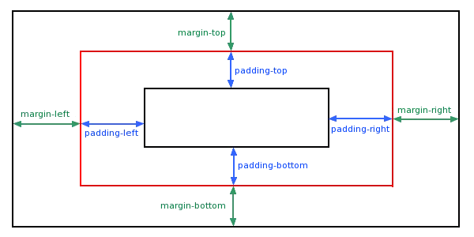

## 🔸 THUỘC TÍNH MARGIN 👩🏽‍💻👨🏽‍💻
**Lý thuyết:** Trong CSS, Thuộc tính margin được sử dụng để tạo ra khoảng không gian trống (space) xung quanh các phần tử. Thuộc tính này thiết lập khoảng trống BÊN NGOÀI đường viền (border). Giá trị của thuộc tính margin không được kế thừa bởi các phần tử con.
    
**Cách sử dụng thuộc tính margin trong CSS.**   
Để sử dụng thuộc tính margin, ta dùng cú pháp như sau: `margin: <giá trị>px;`
- Các loại cú pháp:
    + Cú pháp 1:
         `margin: value1 value2 value3 value4;`
        + Lề phía trên của phần tử sẽ có khoảng cách là value1
        + Lề bên phải của phần tử sẽ có khoảng cách là value2
        + Lề phía dưới của phần tử sẽ có khoảng cách là value3
        + Lề bên trái của phần tử sẽ có khoảng cách là value4
            
    + Cú pháp 2:
         `margin: value1 value2 value3;`
        + Lề phía trên của phần tử sẽ có khoảng cách là value1
        + Lề bên trái & bên phải của phần tử sẽ có khoảng cách là value2
        + Lề phía dưới của phần tử sẽ có khoảng cách là value3

    + Cú pháp 3:
         `margin: value1 value2;`
        + Lề phía trên & phía dưới của phần tử sẽ có khoảng cách là value1
        + Lề bên trái & bên phải của phần tử sẽ có khoảng cách là value2

    + Cú pháp 4
         `margin: value;`
        + Lề phía trên, dưới, trái, phải của phần từ sẽ có khoảng cách là value

## 🔹  THUỘC TÍNH PADDING 👩🏽‍💻👨🏽‍💻
**Lý thuyết:** Các thuộc tính đệm (padding)CSS được sử dụng để tạo không gian xung quanh nội dung của phần tử, bên trong bất kỳ đường viền xác định nào. Với CSS, bạn có toàn quyền kiểm soát phần padding . Có các thuộc tính để thiết lập phần padding cho mỗi bên của một phần tử (trên cùng, bên phải, dưới cùng và bên trái).

**Cách sử dụng thuộc tính padding trong CSS.**   
Để sử dụng thuộc tính padding, ta dùng cú pháp như sau: `padding: <giá trị>px;`
- Các loại cú pháp:
    + Cú pháp 1:
         `padding: value1 value2 value3 value4;`
        + Vùng đệm phía trên của phần tử sẽ có khoảng cách là value1
        + Vùng đệm bên phải của phần tử sẽ có khoảng cách là value2
        + Vùng đệm phía dưới của phần tử sẽ có khoảng cách là value3
        + Vùng đệm bên trái của phần tử sẽ có khoảng cách là value4
            
    + Cú pháp 2:
         `padding: value1 value2 value3;`
        + Vùng đệm phía trên của phần tử sẽ có khoảng cách là value1
        + Vùng đệm bên trái & bên phải của phần tử sẽ có khoảng cách là value2
        + Vùng đệm phía dưới của phần tử sẽ có khoảng cách là value3

    + Cú pháp 3:
         `padding: value1 value2;`
        + Vùng đệm phía trên & phía dưới của phần tử sẽ có khoảng cách là value1
        + Vùng đệm bên trái & bên phải của phần tử sẽ có khoảng cách là value2

    + Cú pháp 4
         `padding: value;`
        + Vùng đệm phía trên, dưới, trái, phải của phần từ sẽ có khoảng cách là value

## 🔸 THUỘC TÍNH FLEX-BOX 🔥
**Lý thuyết:** Flex css là một kiểu dàn trang mà khi sử dụng nó sẽ tự cân đối kích thước của các thành phần để hiển thị trong mọi thiết bị. Điều đó có nghĩa là bạn không cần ngồi căn chỉnh kích thước phần tử, không cần ngồi float chỉ cần thiết lập nó theo chiều ngang dọc là lúc đó các phần tử bên trong sẽ tự hiển thị theo mong muốn.

😲 Sự khác nhau giữa Margin và Padding
-   Để rõ ràng hơn thì chúng ta cùng nhìn vào hình vẽ dưới đây:

- Hiểu 1 cách đơn giản thì thuộc tính padding là khoảng trống nằm giữa nội dung và viền. Padding bao quanh 4 mặt của nội dung, tuy nhiên chúng ta có thể nhắm mục tiêu của padding và thay đổi padding của từng bên với css, hay nói theo cách dễ hiểu padding là khoảng cách so với thẻ con.

- Còn margin là khoảng trống nằm giữa viền và phần tử tiếp theo. Chúng ta cứ hiểu không gian tính từ viền tới các phần tử khác được gọi là margin. Cũng tương tự như padding thì margin cũng bao quanh 4 mặt và bạn có thể nhắm mục tiêu margin trên, dưới, trái, phải cho nó.

- Nếu như padding là khoảng cách so với thẻ con thì margin là khoảng cách so với thẻ cha.
